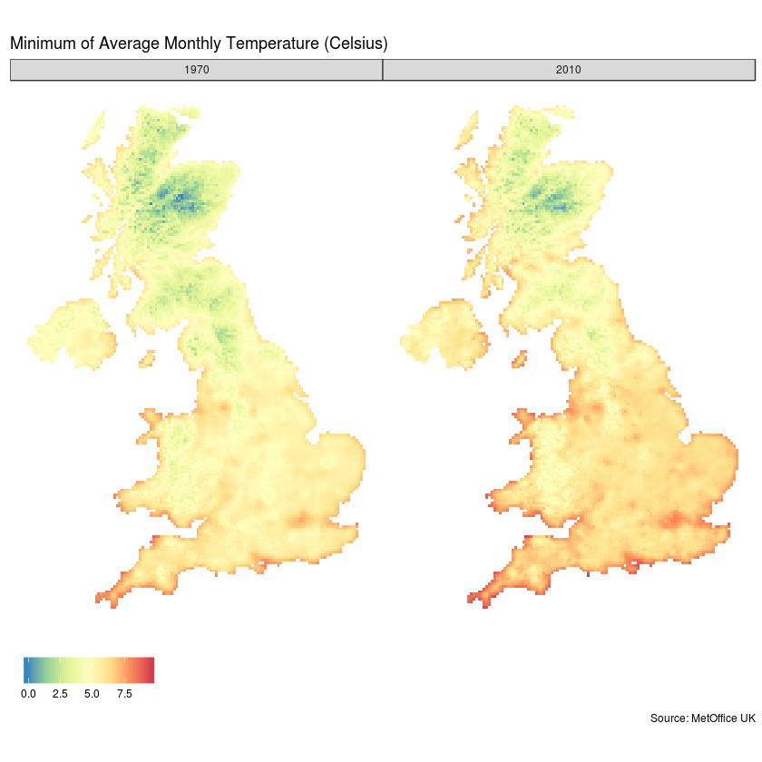
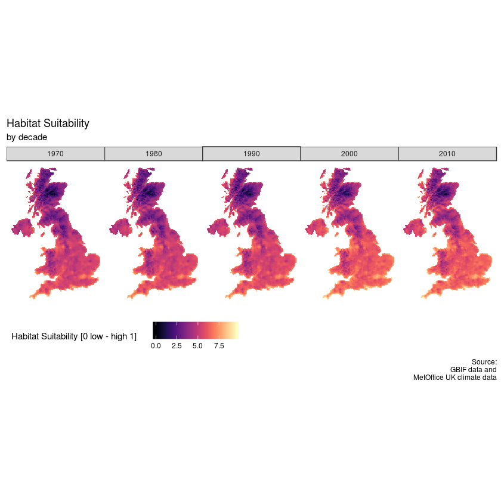

# 气候变化对鸟类的影响分析
## [Learning from datacamp](https://projects.datacamp.com/projects/664)

全球范围的气候变化如何影响动物是一个关于生物多样性的热点问题，我们希望知道如果气候持续变化，鸟类的迁徙会受到怎样的影响。

我们使用GBIF的鸟类监测数据，通过ML建模预测苏格兰交嘴雀（英语：Scottish Crossbill、学名：*Loxia scotica*）的分布。

第一步，关键步骤是获得合适的气候数据，并将其转化为`spdf`的数据格式，保证有`dataframe`的经纬度数据使用。

```r
# Load in the tidyverse, raster, and sf packages
library(tidyverse)
library(raster)
library(sf)

# Read the climate data from an rds file
climate  <- read_rds("climate_raster.rds")

# Have a look at the variables in the climate data
# colnames(climate)

# Convert to SpatialPixelDataFrame for plotting
climate_df <- mutate(
  .data = climate,
  rasters = map(
    .x = rasters,
    ~ as_tibble(as(.x, "SpatialPixelsDataFrame")))) %>%
  unnest(cols = c(rasters))
```


```r
library(ggthemes)

# Filter the data to plot
ggp_temperature <- climate_df %>%
  filter(decade %in% c('1970','2010')) %>%
  # Create the plot
  ggplot(aes(x = x, y = y)) + geom_tile(aes(fill = minimum.temperature)) +
  # Style the plot with options ideal for maps
  theme_map() + coord_equal() +
  facet_grid(~ decade) + scale_fill_distiller(palette = "Spectral") +
  theme(legend.title = element_blank(), legend.position = "bottom") +
  labs(title = "Minimum of Average Monthly Temperature (Celsius)", caption = 'Source: MetOffice UK')

# Display the map
ggp_temperature
```




第二步，通过GBIF获得鸟类分布数据，并清洗数据筛选出时间范围和气候时间变化范围匹配的数据。

```r
occ_search <- function(
  scientificName,
  country,
  hasCoordinate,
  hasGeospatialIssue,
  limit) {
  if (scientificName == "Loxia scotica" &
      country == "GB" &
      hasCoordinate == TRUE &
      hasGeospatialIssue == FALSE &
      limit == 2000) {
    Sys.sleep(2)
    data <- read_rds("datasets/gbif_response.rds")
  } else {
    stop("incorrect arguments to function")
  }
}


library(rgbif)

# Call the API to get the occurrence records of this species
gbif_response <- occ_search(
  scientificName = "Loxia scotica", country = "GB",
  hasCoordinate = TRUE, hasGeospatialIssue = FALSE, limit = 2000)

# Inspect the class and names of gbif_response
class(gbif_response)
names(gbif_response)
# Print the first six lines of the data element in gbif_response
head(gbif_response$data, 6)
```

第三步，从时间序列中提取出来年作为用于机器学习的变量。

```r
library(lubridate)

birds_dated <- mutate(
  .data = gbif_response$data,
  # Create a new column specifying the decade of observation
  decade = ymd_hms(eventDate) %>% round_date("10y") %>% year())

birds_cleaned <- birds_dated %>%
  filter(
    issues == "" &
    str_detect(license, "http://creativecommons.org/") &
    # No records before 1970s decade or after 2010s decade
    ((1970 <= decade) & (decade <= 2010))
  ) %>%
  transmute(decade = decade, x = decimalLongitude, y = decimalLatitude) %>%
  arrange(decade)
```

第四步，对数据进行整合，将气候数据和鸟类数据按照时间进行链接。

```r
birds_nested <- birds_cleaned  %>%
    group_by(decade) %>%
    nest( .key = 'presences')


# Calculate the total number of records per decade
birds_counted <- birds_nested %>%
  mutate(n = map_dbl(presences,nrow))

# Define geographical projections
proj_latlon <- st_crs("+proj=longlat +datum=WGS84 +ellps=WGS84 +towgs84=0,0,0")
proj_ukgrid <- st_crs("+init=epsg:27700")

# Convert records to spatial points and project them
birds_presences <- mutate(birds_counted,
  presences = map(presences, ~ .x %>%
    # Specify the current projection
    st_as_sf(coords = c("x", "y"), crs = proj_latlon) %>%
    # Transform to new projection
    st_transform(crs = proj_ukgrid)))

# Combine the bird data and the climate data in one data frame
birds_climate <- full_join(birds_presences, climate, by = 'decade')

presence_data <- map2_df(
  .x = birds_climate[["rasters"]],
  .y = birds_climate[["presences"]],
  # extract the raster values at presence locations
  ~ raster::extract(.x,.y) %>%
    as_tibble() %>%
    mutate(observation = "presence"))

```


第五步，随机设置出鸟类分布的缺失数据。

```r
# Define helper function for creating pseudo-absence data
create_pseudo_absences <- function(rasters, n, ...) {
    set.seed(12345)
    sampleRandom(rasters, size = n * 5, sp = TRUE) %>%
    raster::extract(rasters, .) %>% as_tibble() %>%
    mutate(observation = "pseudo_absence")
}

# Create pseudo-absence proportional to the total number of records per decade
pseudo_absence_data <- pmap_df(.l = birds_climate, .f = create_pseudo_absences)

# Combine the two datasets
model_data <- full_join(presence_data, pseudo_absence_data) %>%
  mutate(observation = factor(observation)) %>% na.omit()
```

第六步，训练模型，并使用预测值在年度上的变化。

```r

# Load caret and set a reproducible seed
library(caret)
set.seed(12345)

# Create a tuning grid with sets of hyperparameters to try
tuneGrid <- expand.grid(alpha = c(0, 0.5, 1), lambda = c(.003, .01, .03, .06))

# Create settings for model training
trControl <- trainControl(method = 'repeatedcv', number = 5, repeats = 1,
  classProbs = TRUE, verboseIter = FALSE, summaryFunction = twoClassSummary)

# Fit a statistical model to the data and plot
model_fit <- train(
  observation ~ ., data = model_data,
  method = "glmnet", family = "binomial", metric = "ROC",
  tuneGrid = tuneGrid, trControl = trControl)

plot(model_fit)

# Use our model to make a prediction
climate_df[["prediction"]] <- predict(
    object = model_fit,
    newdata = climate_df,
    type = "prob")[["presence"]]

head(climate_df)

library(viridis)

# Create the plot
ggp_changemap <- ggplot(climate_df, aes(x=x, y=y))+
  geom_tile(aes(fill = minimum.temperature)) +
  # Style the plot with the appropriate settings for a map
  theme_map() + coord_equal() +facet_grid(~ decade) +
  scale_fill_viridis(option = "A") + theme(legend.position = "bottom") +
  # Add faceting by decade
  labs(title = 'Habitat Suitability', subtitle = 'by decade',
       caption = 'Source:\nGBIF data and\nMetOffice UK climate data',
       fill = 'Habitat Suitability [0 low - high 1]')


# Display the plot
ggp_changemap
```

